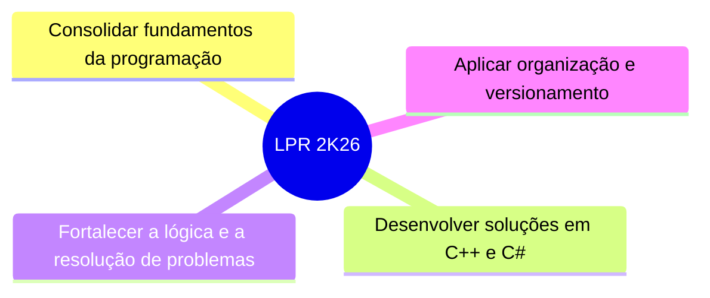

<div align="center">


<br>
<div align="center">

</div>
</br>


<br>


<br><br>
---
</div>

# 👨‍💻 Sobre o repositório

Este repositório reúne todos os exercícios, atividades e projetos desenvolvidos durante a disciplina de **Linguagem de Programação (LPR)** do curso Técnico em **Desenvolvimento de Sistemas (DS)** da **Escola Técnica de Eletrônica Francisco Moreira da Costa (ETE FMC)**.

Além disso, ele representa meu primeiro contato com ferramentas profissionais de desenvolvimento, como **Git**, **GitHub** e **controle de versão**, registrando toda a minha evolução ao longo da disciplina.

**Orientador: Prof. José Andery**

---

# 🗂️ Sumário

- [👨‍💻 Sobre o repositório](#-sobre-o-repositório)
- [📁 Estrutura do repositório](#-estrutura-do-repositório)
- [📚 Conteúdo das aulas](#-conteúdo-das-aulas)
- [▶️ Como executar](#️-como-executar)
- [🎯 Objetivos do projeto](#-objetivos-do-projeto)
- [📈 Status do repositório](#-status-do-repositório)

---

# 📁 Organização do repositório

```text
LPR_2K26/
│
├── Aula01/
│   ├── Exercícios C++
│   └── Projetos C#
│
├── Aula02/
│   ├── Exercícios C++
│   └── Projetos C#
│
├── Aula03/
│   ├── Exercícios
│   └── Projetos
│
├── Aula04/
│   ├── C++/
│   │    └── Ex0x.cpp
│   └── C#/
│        └── program.cs
│        └── Ex0x.csproj
│
├── AulaXX/
...
│
├── LPR_2K26.slnx
│
└── README.md
```

---

# 📚 Conteúdo das aulas

| Aula | Conteúdo desenvolvido | Status |
|:----:|-----------------------|:------:|
| Aula 01 | Conceitos básicos da computação e primeiro programa (**Hello World**) em C++ e C# | ✓ |
| Aula 02 | Introdução à lógica de programação, variáveis, operadores e entrada/saída de dados | ✓ |
| Aula 03 | Git, GitHub e controle de versão | ✓ |
| Aula 04 | Estruturas de seleção (`if`, `else` e `switch`) | ✓ |
| Aula 05 | Estruturas de repetição (`for`, `while` e `do while`) | ✓ |
| Aula 06 | Funções, métodos e modularização de código | ✓ |
| Aula 07 | Variáveis compostas homogêneas (vetores e matrizes) | ✓ |
| Aula 08 | Variáveis compostas heterogêneas (`struct`) | ✓ |
| Aula 09 | Estruturas de dados e coleções | ✓ |
| Próximas aulas | Novos conteúdos serão adicionados conforme o avanço da disciplina. | • |

---

# ▶️ Como executar

<details>
<summary><b> Executando programas em C++</b></summary>

<br>

## 📋 Requisitos

É necessário possuir um compilador C++ instalado.

Algumas opções:

- GCC (MSYS2 ou MinGW);
- Microsoft Visual C++;
- Visual Studio Community;
- Visual Studio Code com a extensão C/C++.

---

## ⚙️ Compilando pelo terminal

Abra o terminal na pasta onde está localizado o arquivo `.cpp`.

Exemplo:

```bash
g++ Ex01.cpp -o Ex01
```

Execute o programa:

**Windows**

```bash
Ex01.exe
```

**Linux**

```bash
./Ex01
```

---

## 🖥️ Executando pelo Visual Studio Code

1. Instale a extensão **C/C++**;
2. Configure o compilador;
3. Abra o arquivo `.cpp`;
4. Compile e execute normalmente.

</details>

<details>
<summary><b> Executando projetos C# (.NET)</b></summary>

<br>

## 📋 Requisitos

Instale:

- .NET SDK;
- Visual Studio Community.

ou

- Visual Studio Code + extensão C#.

---

## ⚙️ Executando pelo terminal

Abra a pasta do projeto.

Exemplo:

```bash
cd Aula06/C#/Ex01
```

Execute:

```bash
dotnet run
```

Caso seja necessário compilar primeiro:

```bash
dotnet build
```

---

## 🖥️ Executando pelo Visual Studio

Abra o arquivo:

```text
Ex01.csproj
```

ou a solução:

```text
LPR_2K26.slnx
```

Depois pressione:

```text
▶ Start
```

ou

```text
F5
```

O projeto será compilado e executado automaticamente.

</details>

---

# 🎯 Objetivos do projeto



---

# 📈 Status do repositório

> [!NOTE]
> Este repositório está em desenvolvimento e será atualizado continuamente conforme novos conteúdos forem apresentados na disciplina de Linguagem de Programação (LPR).
> 
> 🟡 **Status:** Em andamento

---

<div align="center">

<br>

### Desenvolvido por

**Tuany Silva Pereira — 34DS**

**Curso Técnico em Desenvolvimento de Sistemas**

**Escola Técnica de Eletrônica Francisco Moreira da Costa (ETE FMC)**

**Orientador: Prof. José Andery**

**2026**

<br>

<div align="center">

</div>

</div>
